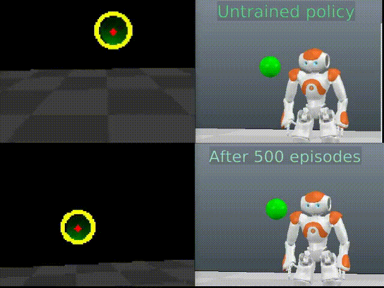

# Summary
This python package contains full integration of V-Rep simulation software, base libraries for NAO robot control along with reinforcement learning algorithms for solving custom learning environments.

## Features:
1. State-of-the-art RL algorithms for training the agent - Proximal Policy Optimization (PPO) and Asynchronous Advantage Actor-Critic (A3C) both of which are parallelized and scale to any number of workers.
2. OpenAI-gym-based API for V-REP simulation software that makes it easy to create new learning tasks and environments (50 - 100 LOC)
3. Reinforcement learning can be done both in simulation and using the real robot interchangeably.
4. Policies learned in simulated environments can be directly tested on the real NAO robot.
5. Grid search scripts for hyperparameter optimization.
6. Several custom learning environments for the NAO robot:
   

  Balancing / Learning a bipedal gait         | Object tracking  
:-------------------------:|:-------------------------:
    | 


# Requirements

### **Base** (for learning in simulated environments with virtual NAO):
1. [VREP v3.4.0](http://coppeliarobotics.com/files/V-REP_PRO_EDU_V3_4_0_Linux.tar.gz) - Robot simulation software by Copellia Robotics
2. *Python 2.7* and *python-virtualenv*. 
3. *tensorflow, gym, numpy, opencv-python*
    

### **Optional** (if you have access to the NAO robot):
1. [Choregraphe Suite v2.1.2](https://community.ald.softbankrobotics.com/en/dl/ZmllbGRfY29sbGVjdGlvbl9pdGVtLTQyNS1maWVsZF9zb2Z0X2RsX2V4dGVybmFsX2xpbmstMC01MzY2MjU%3D?width=500&height=auto) - for creating a virtual NAO (**requires registering**) (By default installed in */opt/Aldebaran/Choregraphe Suite 2.1*)

2. [Python NAOqi SDK v2.1.2](https://community.ald.softbankrobotics.com/en/dl/ZmllbGRfY29sbGVjdGlvbl9pdGVtLTQ1My1maWVsZF9zb2Z0X2RsX2V4dGVybmFsX2xpbmstMC1lZWFmOGU%3D?width=500&height=auto) - Libraries provided by Softbank robotics for NAO control (**requires registering**)

# Installation
*(Tested on Ubuntu 18.04)*

**1. Clone the repository**
   
```
git clone https://github.com/andriusbern/nao_rl
cd nao-rl
```
**2. Create and activate the virtual environment**
   
```
virtualenv env
source env/bin/activate
```

**3. Install the package and the required libraries**
```
python setup.py install
```
You will be prompted to enter the path to your V-Rep installation directory

**4. Launch the virtual NAO and VREP.**

# Testing the environments
To try the environments out (V-Rep will be launched with the appropriate scene and agent loaded, actions will be sampled randomly):
```
import nao_rl
env = nao_rl.make('env_name', headless=False)
env.run()
```
Where 'env_name' corresponds to one of the following available environments:
1. 'NaoTracking'
2. 'NaoBalancing'
3. 'NaoWalking'

# Training

To train the agents in these environments you can use build-in RL algorithms. 

```
python train.py --NaoTracking --ppo --default
```
Arguments:
1. *--ppo* for Proximal Policy Optimization or *--a3c* for Asynchronous Advantage Actor-Critic 
2. --n_workers N : number of parallel workers that train the main network
The environment agent is going to be trained using the optimal parameters that were found by grid search.


